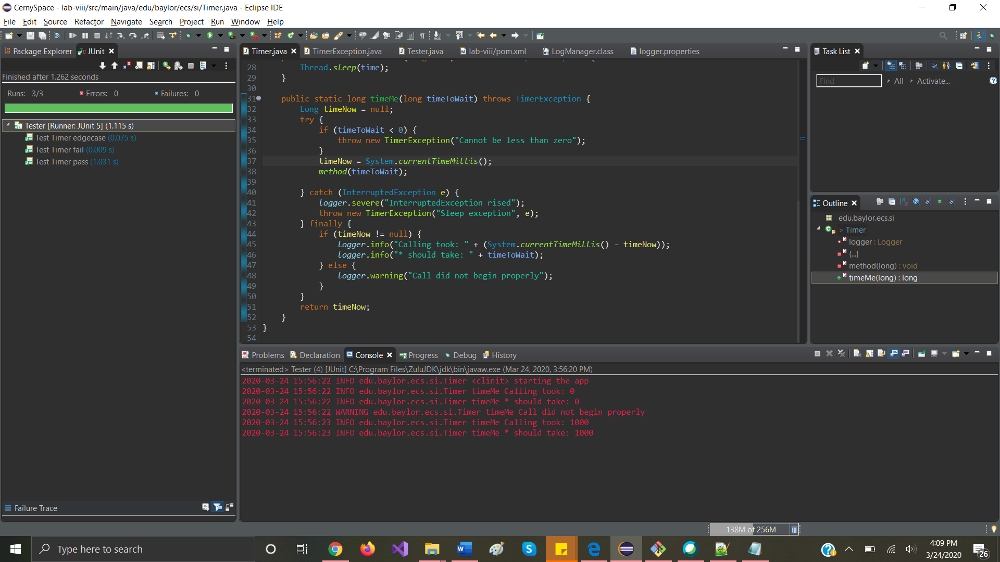
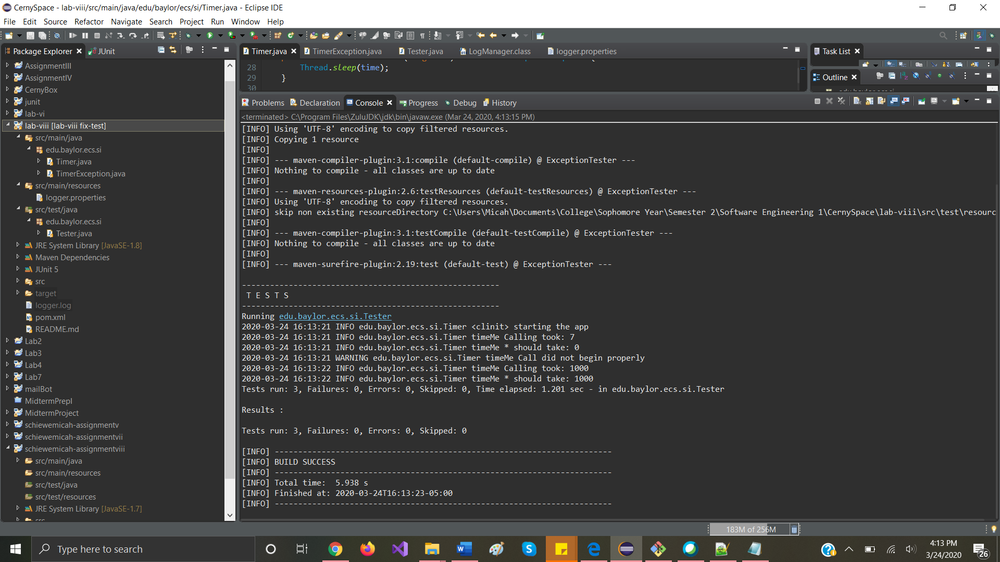

Tasks to answer in your own README.md that you submit on Canvas:

1.  See logger.log, why is it different from the log to console?
    * logger.log differs from the console's log because the console's log is controlled by the ConsoleHandler, which records INFO messages and up (not FINE or FINER messages). Since messages of these other types are logged from other locations (specifically by JUnit), then they do not appear in the log, causing a difference.

1.  Where does this line come from? FINER org.junit.jupiter.engine.execution.ConditionEvaluator logResult Evaluation of condition [org.junit.jupiter.engine.extension.DisabledCondition] resulted in: ConditionEvaluationResult [enabled = true, reason = '@Disabled is not present']
    * An identical log entry, save the insertion of "on [void edu.baylor.ecs.si.Tester.passingTest() throws edu.baylor.ecs.si.TimerException]" between the package name and "resulted in", appears in the logger.log file.
    * Likely of more interest is where the log was *printed* from. It is a FINER-granularity log from the JUnit class ConditionEvaluator.

1.  What does Assertions.assertThrows do?
    * Assertions.assertThrows makes a JUnit test to pass if an exception which is an instance of the specified class is thrown, failing otherwise.

1.  See TimerException and there are 3 questions
    1.  What is serialVersionUID and why do we need it? (please read on Internet)
        * serialVersionUID is an identifier for all serializable classes (such as Exceptions) which indicate which version of the class has been serialized. This provides protection in the event of serializing an object, changing the internal members of the class, and then attempting to de-serialize the old object which no longer matches the version the JVM is aware of. If serialVersionUID in the object being deserialized does not match the version for its class at runtimes, then an InvalidClassException will be thrown by the deserialization. For this protection to work, the serialVersionUID should be changed when major changes are made to a class.
    
    2.  Why do we need to override constructors?
        * If the subclass did not override the constructors which take a message or a message and a Throwable, then one could not create a TimerException with a specified message or cause. Generally speaking, if one wants a user outside of a class to be able to pass arguments to the superclass constructor for a subclass, one must override that constructor in the subclass and pass the arguments to the superclass constructor via super(args here).

    3.  Why we did not override other Exception methods?	
            * Exception only declares a few constructors, most of which are overridden here. Thus, there are no other methods to override; one could have overridden additional constructors, but these are slightly redundant in many cases. Beyond this, Exceptions usually do not need custom behavior, making overriding methods of questionable value.

1.  The Timer.java has a static block static {}, what does it do? (determine when called by debugger)
    * The static block is providing the log.properties file to the LogManager, thus globally initializing all loggers with specific handlers (here, a FileHandler and a ConsoleHandler) with predefined granularity. This allows more concise and static initialization.

1.  What is README.md file format how is it related to bitbucket? (https://confluence.atlassian.com/bitbucketserver/markdown-syntax-guide-776639995.html)
    * README.md is a Markdown file. Markdown is a markup language, allowing the text to be formatted (or have lists and code blocks added, or other such features); this contrasts with a purely-plaintext document like a .txt. It is used on bitbucket to allow for more expressive readmes (think a brief introduction to a project/repository) and pull requests.

1.  Why is the test failing? what do we need to change in Timer? (fix that all tests pass and describe the issue)
    * The test was failing thanks to the fact that the 'finally' block had a chance of attempting to perform an arithmetic operation on null, which threw a NullPointerException and thus overrode the thrown TimerException from the try block. This can be changed such that the finally block checks if timeNow (the variable which could be null) is non-null before attempting to perform an operation on it.

1.  What is the actual issue here, what is the sequence of Exceptions and handlers (debug)
    * The issue was the order in which the exceptions were thrown. Original order shown as comments with indices:
        ```
        public static long timeMe(long timeToWait) throws TimerException {
           Long timeNow = null;                                                    // 1
           try {
              if (timeToWait < 0) {                                                // 2
                 throw new TimerException("Cannot be less than zero");             // Reached 3, not executed
              }
              timeNow = System.currentTimeMillis();
              method(timeToWait);
           } catch (InterruptedException e) {
			     logger.severe("InterruptedException rised");
              throw new TimerException("Sleep exception", e);
           } finally {
              logger.info("Calling took: "+(System.currentTimeMillis()-timeNow));  // 4
              logger.info("* should take: +timeToWait);
           }
           return timeNow;
        }
        ```
        Step 4 throws a NullPointerException, exiting the method.
    * Order of handlers: attempts handling a TimerException by throwing, goes to finally, then induces a NullPointerException, which causes the first exception to not be handled and the second to be thrown. This is not what JUnit asserted would happen for the test in question, causing it to fail.

1.  Make a printScreen of your eclipse JUnit5 plugin run (JUnit window at the bottom panel)
    * Sorry that it's at the left instead of the bottom, my Eclipse defaulted to that configuration.

    

1.  Make a printScreen of your eclipse Maven test run, with console
    * Done using a console in Eclipse since I don't have Maven proper set up on my computer, but Eclipse does.
    
    
    
1.  What category of Exceptions is TimerException and what is NullPointerException
    * TimerException is a checked exception. These must be declared in the signature of a method which might throw them.
    * NullPointerException is a RuntimeException, and thus is unchecked (meaning that the user need not warn the world that the method might throw it).

1.  Push the updated/fixed source code to your own repository.
    * https://github.com/MicahSchiewe/Lab8-LoggerWithJUnit
